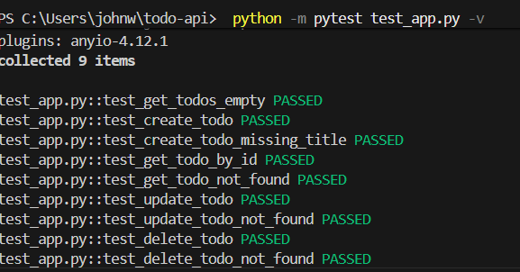

# Todo API

API REST simple pour gérer une liste de tâches (Todo), construite avec Flask et SQLite.

## Installation

```bash
cd todo-api
python -m venv venv
# Windows
venv\Scripts\activate
# macOS/Linux
source venv/bin/activate

pip install -r requirements.txt
```

## Lancer l'application

```bash
python app.py
```

L'application démarre sur `http://localhost:5000` et crée automatiquement la base de données SQLite (`todos.db`) au premier lancement.

## Exécuter les tests

```bash
pytest test_app.py -v
```

Les tests utilisent une base de données SQLite temporaire distincte (`tempfile`) pour ne pas affecter `todos.db`.



## Endpoints de l'API

| Méthode | Endpoint            | Description                          |
|---------|----------------------|---------------------------------------|
| GET     | `/todos`             | Liste toutes les tâches               |
| POST    | `/todos`             | Crée une nouvelle tâche               |
| GET     | `/todos/<id>`        | Récupère une tâche par son ID         |
| PUT     | `/todos/<id>`        | Met à jour une tâche existante        |
| DELETE  | `/todos/<id>`        | Supprime une tâche                    |

## Conteneurisation avec Docker

Construire l'image :

```bash
docker build -t todo-api .
```

Vérifier que l'image existe :

```bash
docker images
```

Lancer un conteneur (avec persistance de la base SQLite sur l'hôte) :

```bash
docker run -p 5000:5000 -v $(pwd)/todos.db:/app/todos.db todo-api
```

L'application est alors accessible sur `http://localhost:5000`.

## Analyse de sécurité avec Trivy

Trivy est utilisé pour scanner l'image Docker et générer un SBOM (Software Bill of Materials).

Scanner l'image (vulnérabilités) :

```bash
docker run --rm -v /var/run/docker.sock:/var/run/docker.sock -v "${PWD}:/output" aquasec/trivy:latest image todo-api
```

Générer un rapport JSON détaillé :

```bash
docker run --rm -v /var/run/docker.sock:/var/run/docker.sock -v "${PWD}:/output" aquasec/trivy:latest image --format json --output /output/trivy-report.json todo-api
```

Générer le SBOM au format SPDX :

```bash
docker run --rm -v /var/run/docker.sock:/var/run/docker.sock -v "${PWD}:/output" aquasec/trivy:latest image --format spdx-json --output /output/sbom.spdx.json todo-api
```

Générer le SBOM au format CycloneDX :

```bash
docker run --rm -v /var/run/docker.sock:/var/run/docker.sock -v "${PWD}:/output" aquasec/trivy:latest image --format cyclonedx --output /output/sbom.cdx.json todo-api
```

> Sur Windows, l'image Docker officielle `aquasec/trivy` est utilisée plutôt qu'un binaire local, en montant le socket Docker (`/var/run/docker.sock`) pour permettre à Trivy d'accéder aux images locales.

### Correction des vulnérabilités critiques

Le premier scan a révélé une vulnérabilité **CRITICAL** dans `perl-base` (CVE-2026-42496, path traversal via `Archive::Tar`), sans correctif disponible côté Debian. Perl n'étant pas utilisé par l'application Flask, le paquet est retiré dans le Dockerfile :

```dockerfile
RUN apt-get remove -y --purge --allow-remove-essential perl-base perl && \
    apt-get autoremove -y && \
    rm -rf /var/lib/apt/lists/*
```

Après cette modification, le scan Trivy ne révèle plus aucune vulnérabilité CRITICAL.

### Exemples avec curl

```bash
# Créer une tâche
curl -X POST -H "Content-Type: application/json" \
  -d '{"title": "Apprendre DevSecOps", "description": "Module 4 TP"}' \
  http://localhost:5000/todos

# Lister les tâches
curl http://localhost:5000/todos

# Récupérer une tâche
curl http://localhost:5000/todos/1

# Mettre à jour une tâche
curl -X PUT -H "Content-Type: application/json" \
  -d '{"title": "Apprendre DevSecOps - Mise à jour", "done": true}' \
  http://localhost:5000/todos/1

# Supprimer une tâche
curl -X DELETE http://localhost:5000/todos/1
```
